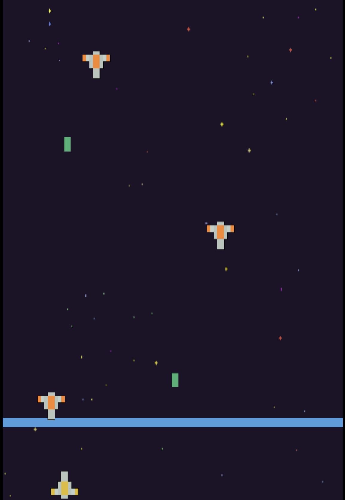
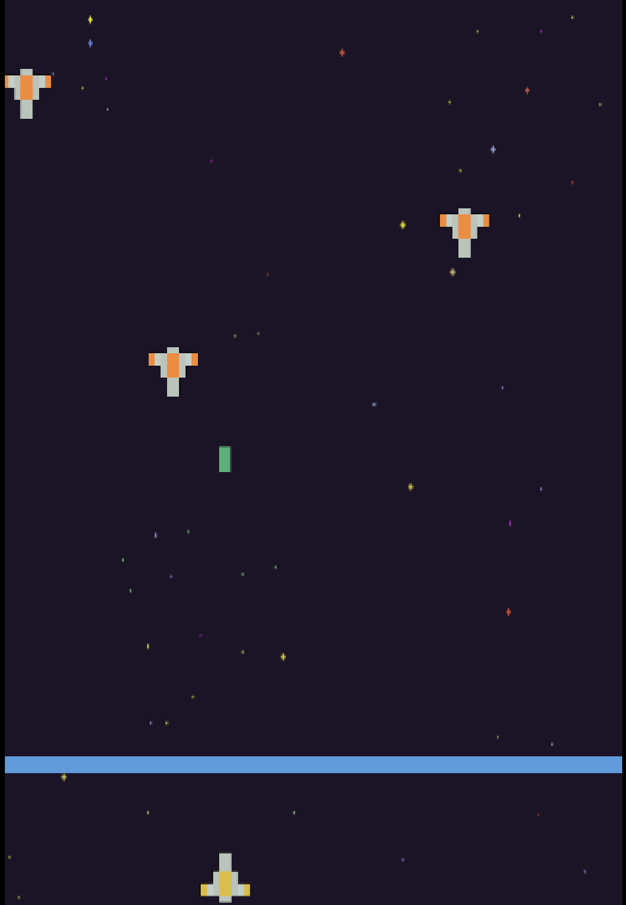

# 🕹️ Time-Pass Game (Godot Project)

Welcome!  
This is just a little **Godot project I made for time-pass 😅**  
Not planning to win any Game Awards with this, but you know...**<i>If it works then it works</i>**

---

## 🎮 What the Game Is About

Honestly… nothing too crazy.  
I just wanted to mess around with **Godot**, learn how nodes work, and slap together some enemies that come towards you just because they’re bored (just like I was when I made this game 😆).

---

## 🪄 Features (if you can call them that)

- A player that moves ✔️  
- Enemies that appear out of nowhere ✔️  
- Collisions ✔️  

---

## 🖼️ Preview Screenshots

> (I will update these once I remember to take proper screenshots 😄)

| Preview 1 | Preview 2 |
|-----------|----------|
|  |  |

---

## 🚀 How to Run

1. Clone the repo:
   ```bash
   git clone https://github.com/Harsh-Cloud-dev/Space-Roket.git
    ```

2. Open in **Godot** (I used version: Godot 4)

3. Hit **Play** 🎯
   (If it breaks — that’s between you and Godot)

---

## 👀 Why This Exists

Because I was bored, and boredom sometimes builds things.
This is one of those things.

---

## 🔧 Future Plans....

* Yes, I plan to **time-pass again** in the future.

---

## 🤝 Contributions

If anyone wants to make something cool out of this, **go ahead**

---

### ⭐ If you liked it for any reason (even by accident), feel free to star the repo!

